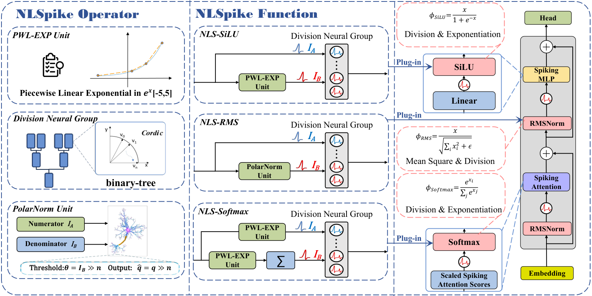

<p align="center">
  
</p>

<h1 align="center">Plug-and-Play Spiking Operators: Breaking the Nonlinearity Bottleneck in Spiking Transformers</h1>

<p align="center">
  用于即插即用 Transformer 非线性算子的可移植 float reference 实现。
</p>

<p align="center">
  <a href="README.md">English</a> | <a href="README-CN.md">中文</a>
</p>

<p align="center">
  <a href="https://opensource.org/licenses/MIT"></a>
  
  
  
</p>

---

## 项目简介

NLSpike 面向 ANN-to-SNN 转换流程中较难直接脉冲化的 Transformer 非线性算子，提供即插即用的近似实现：

- `Softmax`
- `SiLU`
- `RMSNorm`

本仓库发布的是可移植的 **float reference** 实现，主要用于算子级误差评估、消融实验，以及与具体 SNN 后端无关的集成验证。该实现不会绑定到某一个特定的 SpikeLLM、SpikeZIP、SpikingJelly 或自定义 LIF 神经元类。

<p align="center">
  
</p>

## 为什么发布 Float Reference？

不同 SNN 运行时通常有各自的 LIF 状态、重置规则、阈值设置、时间维布局和张量约定。因此，一个所谓“通用”的 LIF 类很容易变得脆弱，也很难直接复用。

因此，本仓库以运行时无关的方式公开 NLSpike 的算子分解：

- **PWL-Exp**：在裁剪区间上的分段线性指数近似
- **Division-style normalization**：商计算阶段的 float reference
- **PolarNorm**：用于 RMSNorm 的 CORDIC-style L2 norm 近似

如果需要接入具体 SNN 框架，可以在该分解的基础上，用对应框架自己的 LIF neuron group 进行后端封装。

## 安装

```bash
pip install -r requirements.txt
pip install -e .
```

## 快速开始

```python
import torch
from nlspike import NLSpikeSiLU, NLSpikeSoftmax, NLSpikeRMSNorm

x = torch.randn(2, 128)
logits = torch.randn(2, 16)

silu = NLSpikeSiLU()
softmax = NLSpikeSoftmax(dim=-1)
rmsnorm = NLSpikeRMSNorm(hidden_size=128)

y_silu = silu(x)
y_softmax = softmax(logits)
y_rmsnorm = rmsnorm(x)
```

## 算子级评估

无需数据集或模型 checkpoint，即可运行算子级随机张量测试：

```bash
python examples/evaluate_operator_errors.py --device cpu
```

该脚本会将 NLSpike 算子与 PyTorch reference 进行对比，并将二者量化到相同的 8-bit 输出网格。默认情况下，SiLU 的测试区间为 `[-5, 5]`，与 reference setting 中的 clipped interval 保持一致。

代表性 CPU 测试结果如下：

| Operator | Setting | Max Abs Error | Mean Abs Error |
|---|---:|---:|---:|
| SiLU | `[-5, 5]` | `3.906250e-03` | `2.775252e-04` |
| Softmax | `dim=8` | `3.906250e-03` | `8.416176e-05` |
| Softmax | `dim=64` | `3.906250e-03` | `1.035631e-05` |
| Softmax | `dim=256` | `3.906250e-03` | `2.570450e-06` |
| RMSNorm | `dim=8` | `3.906250e-03` | `2.253056e-05` |
| RMSNorm | `dim=64` | `3.906250e-03` | `5.055964e-05` |
| RMSNorm | `dim=256` | `3.906250e-03` | `7.186830e-05` |

最大误差受一个 8-bit 网格步长限制，即 `1 / 256`，这与 float reference 的算子级预期行为一致。

## 仓库结构

```text
.
|-- assets/
|   |-- architecture.png
|   `-- logo.svg
|-- examples/
|   `-- evaluate_operator_errors.py
|-- nlspike/
|   |-- __init__.py
|   `-- ops.py
|-- Architecture1.pdf
|-- LICENSE
|-- README.md
|-- README-CN.md
|-- pyproject.toml
`-- requirements.txt
```

## 发布范围

本仓库包含：

- NLSpike SiLU、Softmax 和 RMSNorm 的 float reference 实现
- 算子级随机张量评估脚本
- 架构图和轻量级项目资源

本仓库不包含：

- 数据集或缓存 dataloader
- 预训练权重或量化 checkpoint
- 模型训练代码
- 特定后端绑定的 LIF 类
- 硬件相关 kernel
- 私有路径或机器相关脚本

## 引用

如果该 reference implementation 对你的工作有帮助，请引用：

```bibtex
@article{yuan2026plug,
  title={Plug-and-Play Spiking Operators: Breaking the Nonlinearity Bottleneck in Spiking Transformers},
  author={Yuan, Xinzhe and Peng, Xiang and Gu, Bin and Xiong, Huan},
  journal={arXiv preprint arXiv:2605.20289},
  year={2026}
}
```

## 许可证

本项目基于 MIT License 发布，详见 [LICENSE](LICENSE)。
